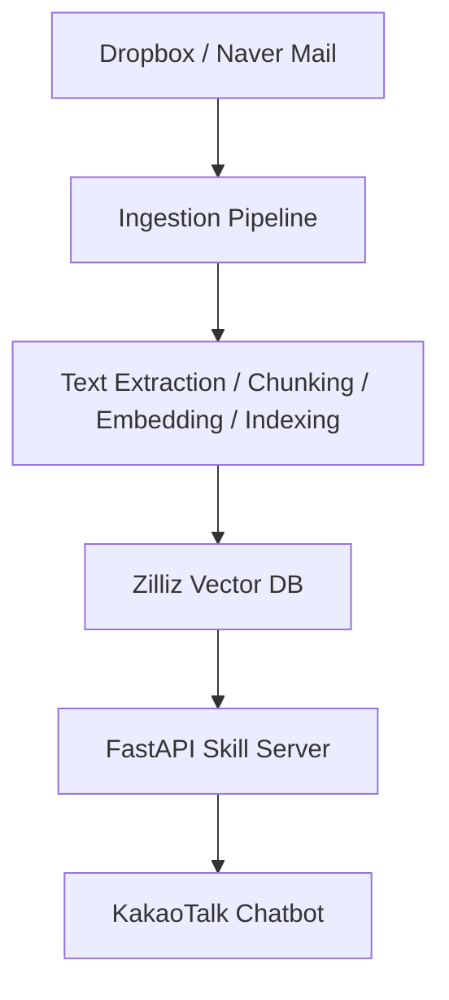

# DnS Trading RAG Chatbot

This project is a RAG-based internal chatbot that indexes company Dropbox documents and Naver emails, then lets users search and ask questions through KakaoTalk.

It was designed to make scattered work materials such as contracts, meeting emails, and business documents searchable directly from a familiar messaging interface.

## Overview

The main goal of this project is to unify distributed documents and emails into a single retrieval flow.  
A FastAPI server handles Kakao skill requests, retrieves relevant context from Zilliz Cloud (Milvus), and uses Gemini models for embedding and answer generation.

## Features

- Automatic ingestion of Dropbox files and Naver emails
- Text extraction, chunking, embedding, and vector indexing
- KakaoTalk-based RAG question answering
- Daily and weekly briefing generation
- Chat logging and LLM cost tracking
- GitHub Actions-based automation for data sync and operations

## Technical Highlights

### Unified Retrieval Flow
Dropbox files and emails are processed through the same retrieval pipeline so users can search without thinking about where the original data is stored.

### Latency-Aware Bot Design
The bot was designed around Kakao skill response time limits, using a callback-based response flow for longer-running requests.  
To reduce cold-start issues on the Render free tier, a health-check keepalive workflow was also added for operational stability.

### Practical Document Processing
The ingestion layer supports file formats commonly used in real business environments, including PDF, Office documents, HWP, and ZIP archives.

### Operational Visibility
The system tracks chat logs, response times, token usage, and estimated LLM cost so that performance and usage can be monitored in production-like conditions.

## Tech Stack

- **Backend:** FastAPI
- **LLM / Embedding:** Google Gemini
- **Vector Database:** Zilliz Cloud (Milvus)
- **Bot Platform:** Kakao i OpenBuilder
- **Automation:** GitHub Actions
- **Hosting:** Render

## Architecture



## Project Structure

```text
src/
  briefing/    # Briefing generation and delivery
  db/          # Zilliz client and schema
  ingestion/   # Sync, extraction, chunking, indexing
  rag/         # Embedding, retrieval, generation, orchestration
  server/      # FastAPI app, Kakao skill endpoints, callback, admin API
scripts/       # Operational and manual utility scripts
tests/         # Pytest-based test suite
docs/          # Operational and implementation notes
```

## Why This Project

### Real Users
The intended users are two employees collaborating remotely across two different countries.

### Business Problem
Because the team works across countries and time zones, it is difficult to keep business context aligned in real time. At the same time, historical materials are scattered across files and emails, making it slow to locate the information needed for ongoing work.  
This project was built to make past documents easier to find and to improve day-to-day knowledge sharing through a familiar chat interface.

### Expected Impact
Even with time zone differences, team members can share work context more smoothly and retrieve past materials much faster, making daily execution and follow-up work significantly easier.
