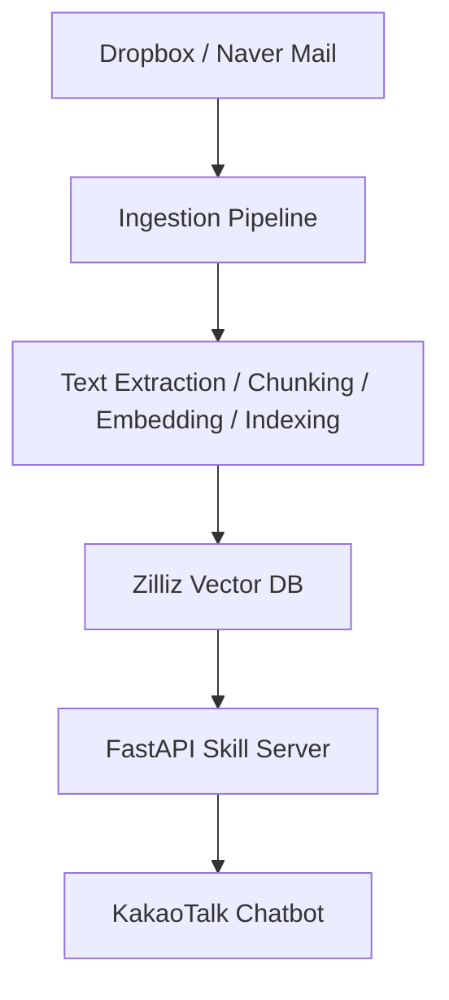
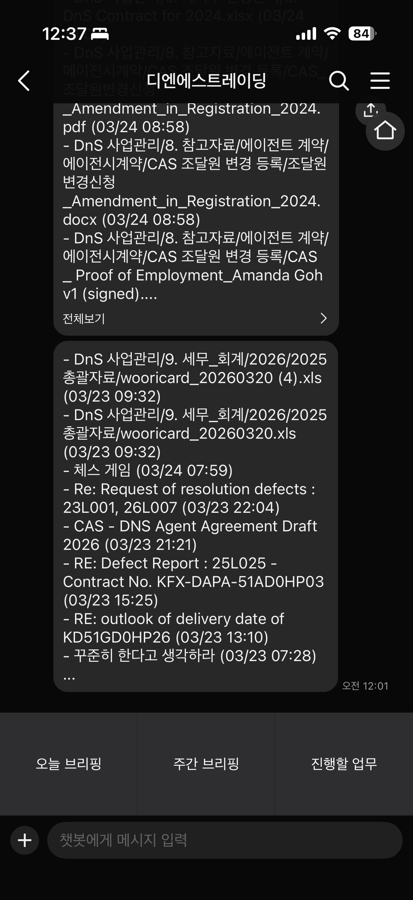

# DnS Trading RAG Chatbot

[Korean](./README.md)

This project is a business-facing RAG chatbot that enables users to access operational knowledge from documents and emails through natural language queries via KakaoTalk.

It was built to solve the problem of fragmented information across Dropbox files and emails, allowing non-technical users to quickly retrieve relevant information without manual searching.

## Overview

The system unifies distributed business data into a single retrieval pipeline.

A FastAPI server handles KakaoTalk skill requests, retrieves relevant context from Zilliz Cloud (Milvus), and uses Gemini models for embedding and answer generation.

This enables users to interact with business knowledge through a familiar messaging interface.

## Problem

The business is operated by two family members working across different countries and time zones.

- One user relocated overseas, making real-time communication difficult
- Business data was scattered across emails and Dropbox documents
- It was time-consuming to locate past materials or understand ongoing work

As a result, sharing work context and tracking progress became inefficient.

## Solution

- Built a system that aggregates emails and documents into a unified knowledge base
- Implemented a RAG pipeline to enable semantic search and question answering
- Integrated the system with KakaoTalk to provide a simple, real-time interface for non-technical users
- Added automated briefing generation to summarize ongoing work

## Impact

- Eliminated the need for manual reporting or document searching
- Enabled instant access to business context through natural language queries
- Improved communication and coordination despite time zone differences
- Users reported high satisfaction due to reduced friction in daily operations

## Features

- Automatic ingestion of Dropbox files and Naver emails
- Text extraction, chunking, embedding, and vector indexing
- KakaoTalk-based RAG question answering
- Daily and weekly briefing generation
- Chat logging and LLM cost tracking
- GitHub Actions-based automation for data sync and operations

## Technical Highlights

### Unified Retrieval Flow
Dropbox files and emails are processed through a single pipeline, allowing users to search without needing to know the original data source.

### Latency-Aware Bot Design
Designed around KakaoTalk skill response time limits using a callback-based response flow for longer-running requests.  
A keep-alive workflow was implemented to reduce cold-start latency on the Render free tier.

### Practical Document Processing
Supports real-world business formats including PDF, Office documents, HWP, and ZIP archives.

### Operational Visibility
Tracks chat logs, response times, token usage, and estimated LLM costs to monitor system performance.

## Design Decisions

- **RAG over fine-tuning**  
  Chosen to enable dynamic updates without retraining and to reduce operational cost

- **KakaoTalk integration**  
  Selected as the primary interface since it is already familiar to non-technical users

- **Vector search (Milvus)**  
  Used for scalable semantic retrieval across heterogeneous data sources

## Tech Stack

- **Backend:** FastAPI
- **LLM / Embedding:** Google Gemini
- **Vector Database:** Zilliz Cloud (Milvus)
- **Bot Platform:** Kakao i OpenBuilder
- **Automation:** GitHub Actions
- **Hosting:** Render

## Architecture



## Screenshot

An example of the chatbot in actual use on a mobile device.

<p align="center">
  
</p>

## Project Structure

```text
src/
  briefing/    # Briefing generation and delivery
  db/          # Zilliz client and schema
  ingestion/   # Sync, extraction, chunking, indexing
  rag/         # Embedding, retrieval, generation, orchestration
  server/      # FastAPI app, Kakao skill endpoints, callback, admin API
scripts/       # Operational and manual utility scripts
tests/         # Pytest-based test suite
docs/          # Operational and implementation notes
```

## Lessons Learned

- Retrieval quality significantly impacts LLM output quality
- Effective use of metadata is important for both retrieval accuracy and answer quality
- User adoption depends heavily on interface familiarity and simplicity
- Latency constraints must be considered when integrating with messaging platforms

## Why This Project

This project was built for a real small business operated by two family members.

As one member relocated overseas, collaboration became challenging due to time zone differences and fragmented information across emails and documents.

The system was designed to:

- Reduce dependency on manual reporting
- Enable quick access to past and current business information
- Improve day-to-day collaboration through a familiar chat interface

Ultimately, the system allowed users to stay aligned without additional effort, significantly improving their workflow and satisfaction.
