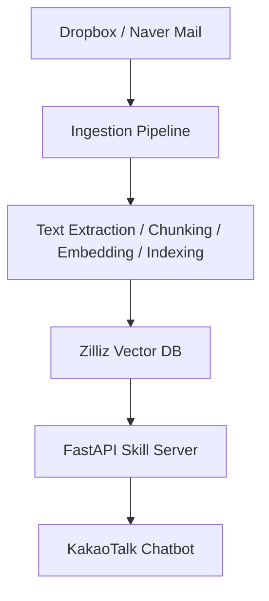

# DnS Trading RAG Chatbot

[English](./README.md)

이 프로젝트는 Dropbox 문서와 이메일에 흩어져 있는 업무 지식을 카카오톡에서 자연어 질의로 바로 확인할 수 있도록 만든 비즈니스용 RAG 챗봇입니다.

비기술 사용자도 별도의 검색 과정 없이 필요한 정보를 빠르게 찾을 수 있도록 설계했습니다.

## Overview

이 시스템은 분산된 비즈니스 데이터를 하나의 검색 파이프라인으로 통합합니다.

FastAPI 서버가 카카오톡 스킬 요청을 처리하고, Zilliz Cloud(Milvus)에서 관련 문맥을 검색한 뒤 Gemini 모델을 사용해 임베딩과 답변 생성을 수행합니다.

이를 통해 사용자는 익숙한 메시징 인터페이스 안에서 업무 지식에 접근할 수 있습니다.

## Problem

이 비즈니스는 서로 다른 2개 국가에서 원격으로 협업하는 가족 구성원 2명이 운영하고 있습니다.

- 한 명이 해외로 거주지를 옮기면서 실시간 소통이 어려워졌고
- 업무 데이터는 이메일과 Dropbox 문서에 분산되어 있었으며
- 과거 자료를 찾거나 현재 업무 맥락을 파악하는 데 많은 시간이 들었습니다

그 결과, 업무 맥락 공유와 진행 상황 파악이 비효율적으로 이루어졌습니다.

## Solution

- 이메일과 문서를 하나의 지식베이스로 통합하는 시스템 구축
- 의미 기반 검색과 질의응답을 위한 RAG 파이프라인 구현
- 비기술 사용자도 쉽게 사용할 수 있도록 카카오톡 인터페이스와 연동
- 진행 중인 업무를 빠르게 파악할 수 있도록 자동 브리핑 기능 추가

## Impact

- 수동 보고나 문서 탐색에 들던 시간을 줄임
- 자연어 질의를 통해 업무 맥락에 즉시 접근 가능
- 시차가 있어도 커뮤니케이션과 업무 조율이 더 원활해짐
- 일상적인 업무 흐름의 마찰이 줄어 사용자 만족도가 높아짐

## Features

- Dropbox 및 네이버 메일 데이터 자동 수집
- 문서 텍스트 추출, 청킹, 임베딩, 벡터 인덱싱
- 카카오톡 기반 RAG 질의응답
- 일간 / 주간 브리핑 생성
- 채팅 로그 및 LLM 비용 추적
- GitHub Actions 기반 데이터 동기화 및 운영 자동화

## Technical Highlights

### Unified Retrieval Flow
Dropbox 파일과 이메일을 하나의 검색 파이프라인으로 처리해, 사용자가 원본 데이터 위치를 몰라도 바로 검색할 수 있도록 구성했습니다.

### Latency-Aware Bot Design
카카오톡 스킬 응답 제한 시간을 고려해 callback 기반 응답 구조를 적용했습니다.  
또한 Render 무료 플랜의 cold start 영향을 줄이기 위해 keepalive 워크플로우를 운영에 포함했습니다.

### Practical Document Processing
PDF, Office 문서, HWP, ZIP 등 실제 업무 환경에서 자주 사용하는 파일 형식을 처리할 수 있도록 설계했습니다.

### Operational Visibility
채팅 로그, 응답 시간, 토큰 사용량, 예상 비용을 추적할 수 있도록 구성해 운영 중 성능을 관찰할 수 있게 했습니다.

## Design Decisions

- **파인튜닝 대신 RAG 선택**  
  재학습 없이 최신 데이터를 반영할 수 있고 운영 비용을 낮출 수 있기 때문입니다.

- **카카오톡 연동**  
  비기술 사용자에게 이미 익숙한 인터페이스여서 도입 장벽이 낮기 때문입니다.

- **Milvus 기반 벡터 검색**  
  서로 다른 데이터 소스를 대상으로 의미 기반 검색을 확장 가능하게 처리하기 위해 선택했습니다.

## Tech Stack

- **Backend:** FastAPI
- **LLM / Embedding:** Google Gemini
- **Vector Database:** Zilliz Cloud (Milvus)
- **Bot Platform:** Kakao i OpenBuilder
- **Automation:** GitHub Actions
- **Hosting:** Render

## Architecture



## Screenshot

실제 휴대폰에서 사용 중인 카카오톡 인터페이스 예시입니다.

<p align="center">
  
</p>

## Project Structure

```text
src/
  briefing/    # 브리핑 생성 및 발송
  db/          # Zilliz client, schema
  ingestion/   # 동기화, 텍스트 추출, 청킹, 인덱싱
  rag/         # 임베딩, 검색, 생성, 체인
  server/      # FastAPI 앱, 카카오 스킬 엔드포인트, 콜백, 관리자 API
scripts/       # 운영 및 수동 실행 스크립트
tests/         # pytest 기반 테스트
docs/          # 운영/구현 문서
```

## Lessons Learned

- 검색 품질이 LLM 응답 품질에 직접적인 영향을 준다는 점
- 적절한 메타 정보를 활용하는 것이 검색 정확도와 응답 품질에 중요하다는 점
- 사용자 채택은 인터페이스의 익숙함과 단순함에 크게 좌우된다는 점
- 메시징 플랫폼 연동에서는 지연 시간 제약을 설계 초기에 고려해야 한다는 점

## Why This Project

이 프로젝트는 실제 소규모 가족 비즈니스를 위해 만든 시스템입니다.

한 명이 해외로 거주지를 옮긴 이후, 시차와 분산된 문서/이메일 때문에 협업이 점점 어려워졌습니다.

이 시스템은 다음을 목표로 설계했습니다.

- 수동 보고 의존도를 낮추는 것
- 과거와 현재의 업무 정보를 빠르게 찾을 수 있게 하는 것
- 익숙한 채팅 인터페이스를 통해 일상적인 협업을 더 쉽게 만드는 것

결과적으로 사용자는 별도의 추가 노력 없이도 업무 맥락을 더 잘 공유할 수 있게 되었고, 실제 업무 진행 흐름도 훨씬 수월해졌습니다.
