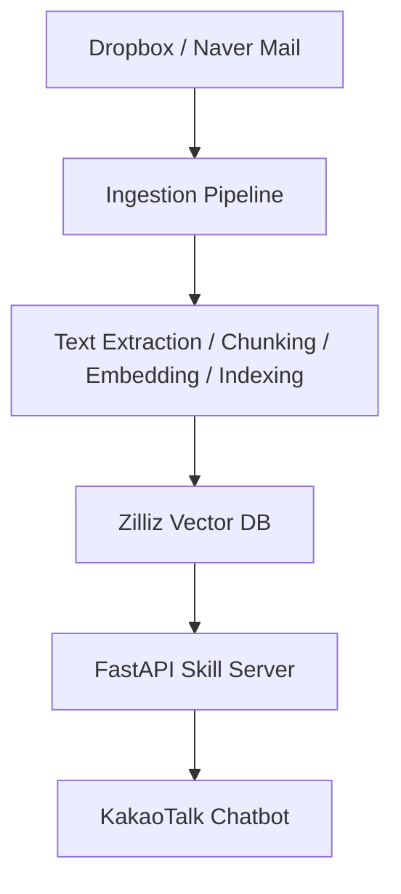

# DnS Trading RAG Chatbot

[English](./README.en.md)

사내 Dropbox 문서와 네이버 메일을 통합 인덱싱하고, 카카오톡에서 자연어로 질의응답할 수 있도록 구현한 RAG 기반 업무 챗봇입니다.

업무 문서, 계약서, 회의 메일처럼 흩어져 있는 정보를 메신저 안에서 바로 검색할 수 있도록 설계했습니다.

## Overview

이 프로젝트는 분산된 업무 문서와 이메일을 하나의 검색 흐름으로 통합하는 데 초점을 맞췄습니다.  
FastAPI 서버가 카카오 스킬 요청을 처리하고, Gemini 임베딩 및 생성 모델과 Zilliz Cloud(Milvus)를 활용해 관련 문서를 검색한 뒤 답변을 생성합니다.

## Features

- Dropbox 및 네이버 메일 데이터 자동 수집
- 문서 텍스트 추출, 청킹, 임베딩, 벡터 인덱싱
- 카카오톡 기반 RAG 질의응답
- 일간 / 주간 브리핑 생성
- 채팅 로그 및 LLM 비용 추적
- GitHub Actions 기반 데이터 동기화 및 운영 자동화

## Technical Highlights

### Unified Retrieval Flow
Dropbox 파일과 이메일을 동일한 검색 파이프라인으로 연결해 사용자가 데이터 위치를 따로 구분하지 않고 질의할 수 있도록 구성했습니다.

### Latency-Aware Bot Design
카카오 스킬 응답 시간 제한을 고려해 callback 기반 응답 구조를 적용했습니다.  
또한 Render 무료 플랜의 sleep 이슈를 줄이기 위해 health-check keepalive를 운영 자동화에 포함했습니다.

### Practical Document Processing
PDF, Office 문서, HWP, ZIP 등 실제 업무 환경에서 자주 사용하는 파일 형식을 처리할 수 있도록 텍스트 추출 파이프라인을 구현했습니다.

### Operational Visibility
질의응답 로그, 응답 시간, 토큰 사용량, 비용을 추적할 수 있도록 구성해 운영 단계에서의 개선 가능성을 확보했습니다.

## Tech Stack

- **Backend:** FastAPI
- **LLM / Embedding:** Google Gemini
- **Vector Database:** Zilliz Cloud (Milvus)
- **Bot Platform:** Kakao i OpenBuilder
- **Automation:** GitHub Actions
- **Hosting:** Render

## Architecture



## Project Structure

```text
src/
  briefing/    # 브리핑 생성 및 발송
  db/          # Zilliz client, schema
  ingestion/   # 동기화, 텍스트 추출, 청킹, 인덱싱
  rag/         # 임베딩, 검색, 생성, 체인
  server/      # FastAPI 앱, 카카오 스킬 엔드포인트, 콜백, 관리자 API
scripts/       # 운영 및 수동 실행 스크립트
tests/         # pytest 기반 테스트
docs/          # 운영/구현 문서
```

## Why This Project

### Real Users
이 시스템의 실제 사용자는 서로 다른 2개 국가에서 원격으로 협업하는 직원 2명입니다.

### Business Problem
원격 협업 환경과 시차 때문에 업무 맥락을 빠르게 공유하기 어렵고, 과거 업무 자료가 파일과 메일 형태로 흩어져 있어 필요한 정보를 찾는 데 시간이 많이 들었습니다.  
이 프로젝트는 이러한 문제를 줄이기 위해, 과거 자료를 쉽고 빠르게 검색하고 카카오톡 안에서 바로 확인할 수 있도록 설계했습니다.

### Expected Impact
시차가 있더라도 업무 내용을 더 원활하게 공유할 수 있고, 과거 자료를 빠르게 찾아 후속 업무를 진행할 수 있어 전체 협업 효율이 높아지는 것을 기대합니다.
